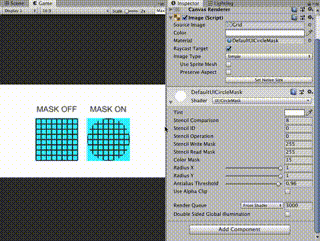
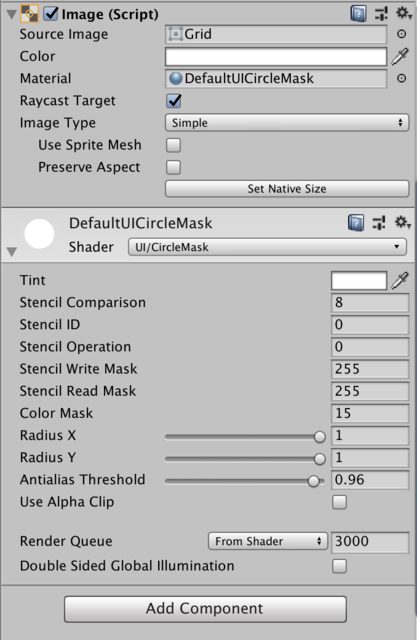

# circle_mask_shader

Circle Mask Shader is mask utility for uGUI Image/RawImage.



## Requirement

Development on
- Unity 2019.3.11f ~

## Install

```shell
yarn add "umm/circle_mask_shader#^1.0.0"
```

or simply put a shader file into your project

- [Assets/Shaders/UI-CircleMask.shader](Assets/Shaders/UI-CircleMask.shader)

## Usage

Steps to attach shader to Image/RawImage component.

1. Create material and change shader to `UI/CircleMask`
2. Attach the material to Image/RawImage GameObject.

### Property



- RadiusX : radius of circle mask, x axis
- RadiusY : radius of circle mask, y axis
- AntialiasThreshold : threshold of antialis width

All of the other properties are derived from Unity's UI/Default shader.

## Example

See [Assets/Examples](Assets/Examples)

## License

Copyright (c) 2019 Takuma Maruyama

Released under the MIT license, see [LICENSE.txt](LICENSE.txt)
